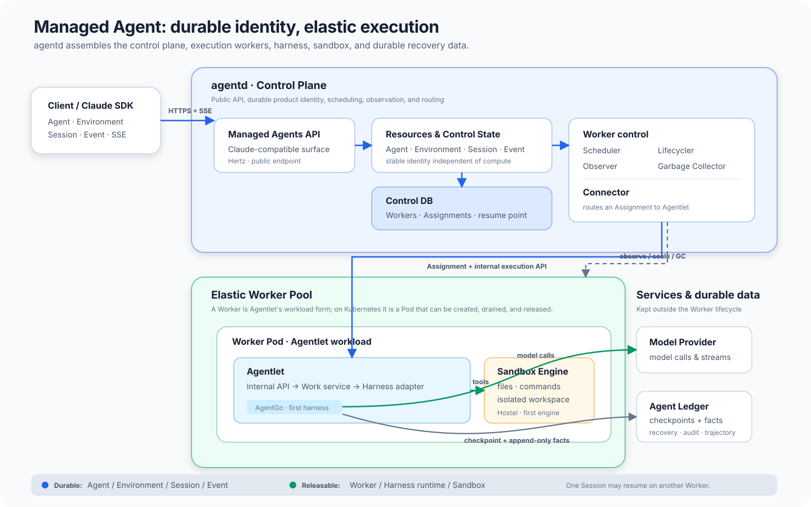

# agentd Control Plane

## 定位

agentd 是 Managed Agent 的 Control Plane，负责全局资源、执行时机、Worker 供给、Session placement
和请求路由，不运行 Harness Loop。执行发生在 Agentlet，二者通过网络协议协作。



## 五类 Control Plane 角色

| 角色 | 回答的问题 | 唯一写权 |
|---|---|---|
| Observer | Worker 是否可用；当前 placement 对应的 Session 执行到了哪里 | `worker.observer_status`、`session.observer_status` |
| Scheduler | 当前 Session 应分配给哪个可用 Worker | 无；只返回纯决策 |
| Worker Pool | Worker row 是否已实现为 Pod，过期空闲 Worker 是否已回收，预热容量是否达到下限 | 串行规划 Worker 创建与回收，通过 Provisioner 实现 Pod |
| Session Reconciler | 哪些持久输入尚待执行，如何收敛为 placement 和 wake | Session placement 动作；通过 Service 更新 Control State，通过 Connector 走数据面 |
| Connector | 带 Assignment 的执行意图如何触达 Agentlet | 无；只走数据面 |

动作、事实、决策和数据面不能合并成一个大 Driver：Worker Pool 创建成功不代表 Ready，Observer 不因
看到空闲容量而创建 Worker，Scheduler 不访问数据库或 Kubernetes，Session Reconciler 不修改 Ledger
执行事实，Connector 不修改 placement。

## Worker、Session 与 Placement

Worker 是 Agentlet 在 agentd 调度域里的 workload 形态和运行载体称呼，也是容量与调度单位；当前
一个 Worker 对应一个 Agentlet Pod。它不是另一种独立服务，也不对应 Kubernetes Node，更不要求
每个物理节点运行一个实例。

Worker 只持久化稳定身份、`capacity`、lifecycle phase 和 Observer facts：

- `id`：agentd 生成的 Worker 唯一身份，同时写入 Pod 的
  `agentd.compforge.dev/worker-id` label；
- `name`：便于运维识别的 Pod 名称；
- `capacity`：最大并发 Work 数；
- lifecycle phase：`creating / active / draining / retired`；
- `observer_status`：最近观测的 `observed_at`、`exists`、`ready` 和可选 `endpoint`。

`sessions` 是 Session Control State 和当前绑定的唯一事实表：`rescheduling` 且 `worker_id` 为空表示
未处理 Event 的需求正在等待容量；真正的 durable demand 仍由 Ledger 中未处理的 Event 表达。
`worker_id` 非空表示当前计算位置。`assignment_id` 随每次重新绑定生成，作为 Agentlet 请求的 fence。
`last_worker_id` 记录最近一次执行位置，是不占容量、不表达所有权的 affinity hint。Domain Model 把
`worker_id + assignment_id + assigned_at` 视为 Session 内嵌的 `Placement`；Assignment 只是 API 和
执行协议从该 placement 派生的值对象，不单独建表、没有独立状态机，也没有自己的 Reconciler。

Session 除身份、Agent/Environment 版本、公开 `status`、当前 placement 和安全恢复点外，还保存
`observer_status`。它记录某个 placement 最近一次成功观测的 `observed_at`、`exists`、执行状态和
ResumeRef；其中携带的 `assignment_id` 是观测 fence。公开 `status` 是 Control Plane 根据该事实生成的
读模型，不由 Agentlet 直接覆盖。

Worker 已用容量由当前绑定的 Session 数计算，不在 Worker 或 observation 中冗余保存：

```text
available = worker.capacity - count(sessions where worker_id = worker.id)
```

控制面当前只需要三个持久化主体：`workers` 保存容量与观测事实，`sessions` 保存需求和绑定，
`resource_locks` 保存多实例短租约。表之间不声明数据库外键，归属一致性由 Service 事务保证。
Go 代码中，稳定对象定义在 `internal/model`，持久化契约定义在 `internal/repo/repository.go`，GORM
表映射和查询放在 `internal/repo/gorm`；`internal/service` 只编排业务事务，不暴露 GORM model。

## Observers

Worker 和 Session 有独立 Observer。两者只采集事实，不做 placement；源访问失败时保留上一次成功事实，
不能把超时或连接错误解释成对象不存在。

### Worker Observer

agentd 创建的 Worker Pod 必须同时带有 `agentd.compforge.dev/managed=true` 和
`agentd.compforge.dev/worker-id=<worker UUID>`。`agentd/internal/worker/k8s` 用带 label selector 的 Pod
Informer 维护本地 cache；Add、Update、Delete 事件只向 Worker Observer 发送可合并通知，Observer 每轮
从 cache 重建全量快照并把事实写入 Worker。低频 cache 扫描负责重试失败写入和兜底收敛。Agentlet
不主动注册或发送 heartbeat，也不存在外部 Worker 写入 API。

Worker identity 不等于 Pod UID。Pod 名、UID、IP 和 Ready 都是 `observer_status` 中的外部事实。
Kubernetes 可以重启 Pod 内容器；Pod 消失则旧 Worker 退役，Session Reconciler 必要时发布新的 Worker
row，Worker Pool 创建 Pod，执行中的
Session 按普通 checkpoint 恢复路径收敛。agentd 不实现 Worker 原地恢复协议。

Scheduler 只消费 observation 足够新、`exists=true`、`ready=true` 且具有 endpoint 的 Worker。
Observer status 与 lifecycle phase 正交：前者描述 Kubernetes 里的外部事实，后者描述 agentd 正在
采取的动作。Informer cache 只提供 `PodSnapshot`，Worker Observer 仍是事实的唯一写入者；Worker
Pool 创建前的 Pending/Unschedulable 背压检查则直接读取 Kubernetes，不使用可能滞后的 cache。

### Session Observer

Session Observer 只轮询数据库中仍有有效 placement 的 Session，通过 Worker 最新 endpoint 读取
Agentlet `/state`，再把结果提交给 Control State。它不调用 `Ensure`；观察不能创建 Work，也不能因为
读取行为改变执行状态。

每次提交同时受两个 fence 保护：`assignment_id` 必须仍匹配当前绑定，`observed_at` 不能早于已经保存的
事实。通过 fence 后，ResumeRevision 只能单调前进。Observer 只提交 observation、公开状态和
ResumeRef，不释放 placement；idle、terminated 或明确 `exists=false` 只是供 Session Reconciler
判断安全边界的事实。多个 agentd 副本可以并行观察，较旧响应不会覆盖新事实。

## Session Reconciler

公开 Event API 先把 `user.message` 写入共享 Ledger，再确认接收；接收成功不依赖当前是否存在 Worker、
placement 或健康 Agentlet。未标记 processed 的 `user.message` 就是 Session 的 durable execution
demand，不另建一份 Work queue 或待执行表。

Session Reconciler 收到 API、Worker Observer 或 Session Observer 的进程内通知时立即运行，同时周期
扫描所有 Session，因此通知丢失或 agentd 重启不会丢失执行需求。它是 placement 动作的唯一 owner，
每轮按以下顺序收敛：

1. 从 Ledger 读取 Session 的未处理 `user.message`，把是否存在输入作为 durable demand；
2. 无 demand 时，只在当前执行已观测为 idle/terminated，或 Worker 已被明确确认不存在时释放 placement；
3. 有 demand 且尚未 placement 时，通过 Service 调用 Scheduler；优先使用 Ready Worker，其次预留
   尚有容量的 `creating` Worker。都不存在时，在同一事务中创建 Worker row 并写入 Session placement；
4. 有 demand 且已有执行时，不因 endpoint 过期、连接超时或一次 Connector 失败自行迁移；只有旧执行
   到达安全边界或 Worker 被明确确认不存在，才重新评分并保留或更换 Worker；
5. Connector 幂等 `Ensure` 当前 WorkSpec，再发送可合并的 `wake`；Agentlet 完成后写入执行 Event 并
   标记原输入 processed，下一轮自然进入 placement 释放判断。

这一区分沿用 sandctl/hostel 的经验：`unknown` 不是 `absent`，Scheduler 的快照选择也不是 Agentlet
最终 admission。Agentlet 在 `Ensure` 时按本地 Work 容量再次接纳；超时属于结果不明，不能据此漂移。
Control Plane 的 DB 事务防止正常路径超配，Agentlet fence 与幂等安装处理重复请求。

Event 是 durable demand，内存 notification 只降低延迟。多个 agentd 副本可以同时扫描并重复
`Ensure`/`wake`：placement 由数据库事务保护，Agentlet 对相同 fence 的 Work 安装与
唤醒保持幂等。Worker 故障收敛和 Sandbox instance 恢复是其它组件的职责，不能从一次转发失败直接
推导；Sandbox 的持久化与恢复能力边界见 `sandbox-engine.md`。

## Scheduler

Service 在数据库事务中锁定 Worker，加载 DB 中的 Worker observation、当前 Session binding 和绑定数，再把 typed candidates
交给 Scheduler。Scheduler 是无 I/O 的纯 placement 策略：

1. 对通过硬过滤的候选计算迁移后的 projected capacity headroom；
2. 当前 placement 和 `last_worker_id` 分别提供由高到低的 affinity bonus，二者都是软约束；
3. headroom 差距足够大时允许选择其它 Worker，当前 placement 不能为了粘滞长期堆高单点负载；
4. 相同分数按 Worker ID 保持确定顺序；
5. 没有候选时返回 `no capacity`，不直接创建 Pod。

```text
Session 需要执行
  → load and lock candidates
  → Scheduler decision
  ├─ hard filter: active + Ready + fresh + placement capacity
  ├─ score: projected capacity headroom
  │        + current placement affinity
  │        + last Worker affinity
  │    ├─ current Worker wins → reuse placement fence
  │    └─ other Worker wins → update worker_id + last_worker_id + assignment_id
  └─ no capacity → create Worker row + reserve Session placement
```

两级 Affinity 都只减少 Harness State 恢复、模型调用重做和工具副作用对账成本，不参考 Sandbox
locality。Sandbox 的粘滞和物理位置由 Sandbox Engine 自己屏蔽；旧 Worker 不可用、负载明显更高或已满
时，Scheduler 可以选择其它候选，当前 placement 和 `last_worker_id` 都不能阻止漂移或占住容量。

## Worker Pool

Session Reconciler 是 demand 到 placement 的 owner：没有可用或可预留容量时，它创建 `creating` Worker
row，并立即用 `session.worker_id` 预留容量。Worker row 表达期望实例，Worker Pool 负责把它实现为
Pod；Session Reconciler 写入新 placement 后会即时通知它。它不读取 Event，也不重新计算 Session demand。

Worker Pool 是容量创建与回收的唯一控制环。容量 ticker、GC ticker 和即时通知都进入同一个 runner；
full pass 在同一短 lease 内先持久化回收计划，再按回收后的 Worker rows 计算创建缺口。lease 冲突会在
本轮 controller timeout 内等待重试，不能作为一次空成功被吞掉。

Pool 内部计划与 Kubernetes 操作分两层：

| 层 | 职责 |
|---|---|
| Worker capacity/reclamation planner | 持久化 Worker 创建、阶段迁移和回收计划 |
| Worker Provisioner | 幂等 `Ensure` / `Destroy` 一个 Worker Pod |

`Ensure` 返回只表示 Kubernetes 接受期望状态；Observer 写入 Ready 后 Connector 才能使用 Worker。
扩容采用有上限的小批次。创建 Pod 前，Worker Pool 直接读取 Kubernetes；若受管 Pod 存在
`Pending` 或 `PodScheduled=False/Unschedulable`，将其视为 Kubernetes 对 agentd 的背压，本轮不再创建
Pod，也不补预热容量。这个 live precheck 是例外；其余控制决策等待 Observer 把事实落库后再进行。

### 预热与按需扩容

预热不使用独立 controller。Worker Pool 只根据 Worker rows 和预热配置计算，不重复读取或计算
Session demand：

1. Session Reconciler 优先占用 Ready Worker 的空闲 slot；
2. 没有 Ready 容量时，可预留 creating Worker 的剩余 slot；
3. Worker Pool 保证 active 与 creating Worker 总数不低于 `minWorkers`；
4. 再补足零绑定 Session 的 `minIdleWorkers`；
5. 每轮实际创建 Pod 的数量受 `createBatchSize` 限制；
6. Kubernetes 返回 Pending 或 Unschedulable 时停止本轮创建。

`minWorkers` 当前默认且最小为 1，用于保留一个预热执行节点；Event 读取已经不依赖常驻 Agentlet；
`minIdleWorkers` 默认 0，不要求 Worker 忙时额外常驻空闲实例。Session Reconciler 与 Worker Pool
各自的唤醒 channel 都只合并通知，不携带 Session、Worker 或数量；周期 reconcile 和即时唤醒都从数据库重新计算相同目标。
空闲 Worker 超过 idle TTL 后可以轮换，若
因此低于总数或 idle floor，下一轮用当前镜像和模板补回。

creating Worker 的 Pod 缺失时，Worker Pool 幂等完成创建；active Worker 的 Pod 缺失时先退役旧
Worker，再由 Session Reconciler 根据 durable demand 发布新 Worker。Kubernetes 存在带 managed label 的 Pod 而数据库没有对应
Worker 时，超过 grace period 后按批删除。每个 agentd 副本都运行这些循环，不依赖全局 Leader：
Worker 创建与回收计划用 `resource_locks` 中的同一短 DB lease 串行化，单 Worker 处置权由 phase CAS 决定，
Observer 写入带 freshness fence，外部动作保持幂等。持有者退出后，其 lease 到期或下一轮 reconcile
由其它副本继续。

### 多实例协调

agentd 借鉴 sandctl 的分布式收敛原则，但不照搬其每个 Sandbox 任务的长 lease。Worker Pool
处理的是共享容量池，不执行一条 Session 的长任务，因此按动作选择最窄协调方式：

| 动作 | 协调方式 |
|---|---|
| 回收过期容量、计算缺口并插入 `creating` Worker | 同一短 DB lease；先持久化回收状态，再读取剩余容量 |
| 为 `creating` Worker 创建 Pod | 先有 Worker 行，再幂等 `Ensure`；Pod AlreadyExists 视为成功 |
| `creating → active` | Observer Ready 后 phase CAS |
| `active → draining` | 条件更新同时确认零绑定 Session；CAS 胜者拥有回收权 |
| `draining → retired` 和删除 Pod | 再次复核后 CAS，`Destroy` 幂等 |
| Observer 写事实 | 按 Worker identity 合并，并用 freshness fence 拒绝旧 snapshot |
| Session binding | 数据库事务与 Worker 行锁，不能依赖容量循环的 resource lock |

短 DB lease 只保护一次“持久化回收计划并发布 creating demand”，不能覆盖 Pod 启动或删除等待。这样持有者崩溃后
不会长时间阻塞扩容，任意副本都能看到 creating 行并补做幂等 `Ensure`。若以后出现真正需要长时间
独占的单 Worker 动作，再为该动作加入 holder、heartbeat 和过期 takeover，而不是预先把整套协议铺开。

## GC

GC 分成运行资源与数据库记录两类。Pod 回收属于 Worker Pool 的容量控制，Record GC 是独立维护面；
两者使用不同周期和失败重试，不能用删除数据库行顺带代表 Pod 已经释放。

### Pod GC

Pod GC 负责回收 Worker Pod，同时保留 Worker 终态记录用于诊断。Worker 同时满足零绑定 Session、
没有执行中 Work 且超过 idle TTL 后，按以下顺序回收：

```text
active
  → zero-placement/live precheck
  → CAS draining
  → final Work/checkpoint safety check
  → CAS retired
  → Provisioner.Destroy
  → Observer confirms absent
```

`draining` 必须先持久化，使 Scheduler 不再分配新 Session。CAS 胜者获得该 Worker 的处置权；删除前
再次复核运行状态，`Destroy` 保持幂等。Pod GC 同时收敛两类漂移：active Worker 的 Pod 已消失时退役
记录；带 managed label 但其 `worker-id` 不在 `workers` 表的 Pod 是 zombie，全部按批幂等删除。

Worker 行必须先于 Pod 创建提交，因此 zombie 不存在合法的“Pod 已创建、Worker 行稍后补写”窗口。
只有成功读取完整 Worker 集合后才允许删除 zombie；数据库读取失败时 fail closed，本轮不删任何 Pod。

### DB Record GC

DB Record GC 只处理已经 `retired`、Observer 已确认 Pod 不存在且超过记录保留期的 Worker 行。它按
`absent_at, id` 小批选择，并在删除时再次检查 phase、截止时间以及不存在绑定 Session。Record GC
不访问 Kubernetes，也不修改 active/draining Worker；它独立于 Worker source 常驻运行，失败后下一轮
重试即可。

## Connector

Connector 是 Agentlet 执行面的唯一入口。它按 Session 读取 placement，从当前 Worker observation
解析 endpoint，并在转发动作前解析 Agent 引用的 Model，再幂等安装 `WorkSpec`：

```text
execution: Session ID → Agent + Model → placement + fence → Worker → fresh endpoint → ensure WorkSpec → wake/interrupt/state
Event:     agentd API → shared Managed Event Ledger Adapter
```

Model 是控制面资源。公开写 API 接受 provider、上游模型名、base URL 和 API key；公开 create/get/list
响应只返回 `api_key_configured`，不回显凭据。Agent 只持久化 Model 资源 ID。Connector 构造 WorkSpec
时才读取完整 Model 并随内部请求发送给当前 Agentlet；这些连接信息不写入 Event 或 Ledger。

用户 ingress 由 agentd 在公开 API 边界直接写入共享 Ledger；Event list/stream 也由 agentd 直接读取，
不经过 Connector，不要求 Session 有 placement，更不要求存在健康 Worker。Agentlet 只写入它在执行中
产生的事实。

endpoint 是一次解析结果，不是持久化 identity。Connector 不修改 placement、不创建 Worker，也不因连接失败自行迁移 Session。
连接失败或 observation 过期时，它重新解析 facts，并把不可达结果交给上层恢复或重调度流程；是否可以
安全重试仍由 Control State 和 Ledger 判断。

Agentlet 协议适配、显式超时、连接池和 trace context 透传属于 Connector，不能散落
在各个 API handler。

## Control State 与恢复

Control State 保存 Session 当前状态、有效 placement、待处理输入和精确 `ResumeRef`，回答“现在应由
谁、从哪里继续”。Checkpoint、Ledger 与恢复提交顺序见 [agentlet.md](agentlet.md)。

Worker observation 过期、不存在或不 Ready 后，agentd 不能仅凭路由失败重放执行。它先释放或替换
placement，再根据 ResumeRef 和 Ledger 未决 Attempt 判断能否在新 Worker 恢复。工具副作用结果不明
时进入对账或人工处理，不自动重试。

## 部署边界

- Session Reconciler 发布 demand 所需的 Worker row，Worker Pool 实现 Worker Pod、回收空闲容量并维护预热下限；
- agentd Deployment 可以多副本运行；每个副本都运行 API、Scheduler、Connector、Session Observer、
  Session Reconciler 和周期控制器，
  通过 DB lease、phase CAS 与幂等动作协调；
- Kubernetes 管理已创建 Worker Pod 的健壮性和重建；
- SRE 通过 workload 模板管理镜像、资源、placement 约束、故障域和集群容量；
- Agentlet 管理已分配 Session 的 Harness runtime 和 Sandbox Engine 使用，不拥有全局 Worker
  placement；Sandbox 的物理 placement 由独立 Sandbox Control Plane 拥有，不进入 agentd 调度。

Quick Start Helm 形态、Worker 模板和弹性流程见
[`../../deploy/k8s/README.md`](../../deploy/k8s/README.md)。

Session Observer、Session Reconciler 与 Record GC 始终运行。启用 Kubernetes Worker source 后，
每个 agentd 副本还运行 Worker Observer 和 Worker Pool。
无容量时，Session Reconciler 原子创建 Worker row 并预留 placement；Worker Pool 通过 Provisioner
创建 Worker Pod，Observer 确认 Ready 后，Connector 才把请求转发到 Agentlet。Pool 内的 Pod GC 同时收敛
空闲 Worker、已消失 Worker 和无数据库 owner 的受管 Pod。Session Observer 只记录 idle/terminated
事实，Session Reconciler 在安全边界释放 placement；跨 Worker 恢复仍由 Control State 和 Ledger 的
恢复判断负责，不混入 Worker 供给控制器。
